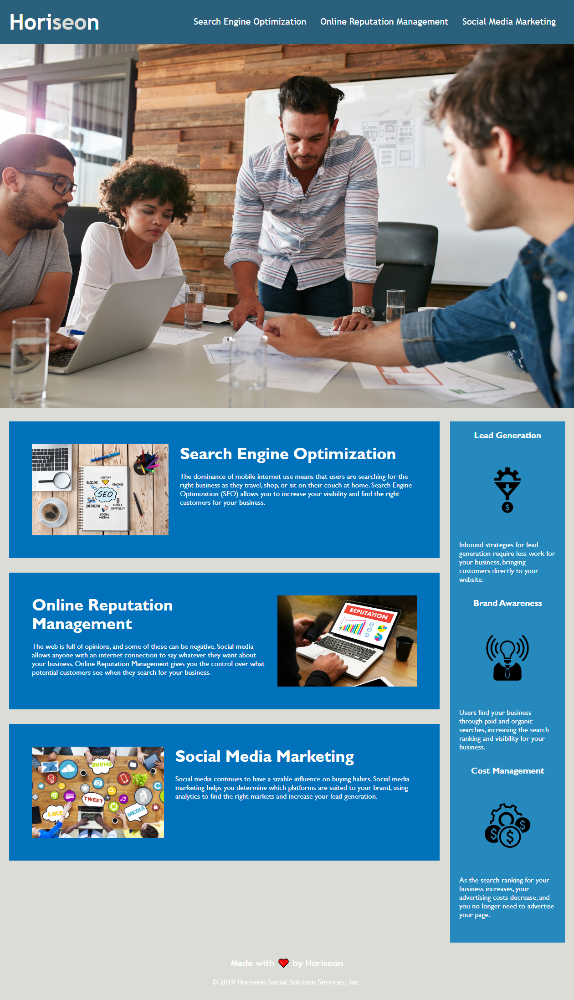

# Horiseon

## Description

For this project I have built a page using semantic HTML elements and CSS.The use of semantic HTML elements will help the page be more visible in search results, as well as more accessible to impaired users. I learned that the way you code matters not just for the appearance and performance, but also SEO and accessibility to different user groups and devices.

## Table of Contents (Optional)

## Installation

## Usage

https://sjuan634.github.io/horiseon-webpage/

## Credits

## License

## Badges

## Features

## How to Contribute

## Tests